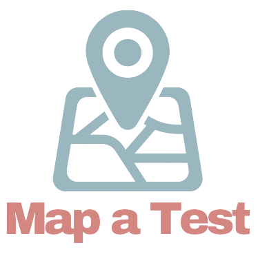

# Map-A-Test

## Table of Contents:

* [Description](#description)
* [Link to the Map-A-Test Site](#live-site)
* [Demo](#demo)
* [Technology Stack](#technology-stack)
* [Authors](#authors)

## Description

## Live Site

* [Map-A-Test: Find a Covid Testing Site Near You](https://laurendarrimon.github.io/find-covid-testing/)

## Demo

## Technology Stack

* [HTML](https://developer.mozilla.org/en-US/docs/Web/HTML)
* [CSS](https://developer.mozilla.org/en-US/docs/Web/CSS)
* [Javascript](https://developer.mozilla.org/en-US/docs/Web/JavaScript)
* [jQuery](https://jquery.com/)
* [Foundation](https://get.foundation/sites/docs/index.html)
* [Parsley](https://parsleyjs.org/doc/index.html)
* [Google Maps Api](https://developers.google.com/maps/documentation/javascript/overview)
* [Finding COVID-19 Testing Sites API](https://developer.here.com/blog/finding-covid-19-testing-sites)

## Authors

**Lauren Darrimon**

* [Lauren's GitHub](https://github.com/LaurenDarrimon)
* [Lauren's LinkedIn](https://www.linkedin.com/in/lauren-lalita-duker-9537b1201/)

**Iman Mansour**

* [Iman's GitHub](https://github.com/imanmansour86)
* [Iman's LinkedIn](https://www.linkedin.com/in/iman-mansour-51391515/)

**Leslie Patino**

* [Leslie's GitHub](https://github.com/lesliejpatino)
* [Leslie's LinkedIn](https://www.linkedin.com/in/lesliejpatino/)
